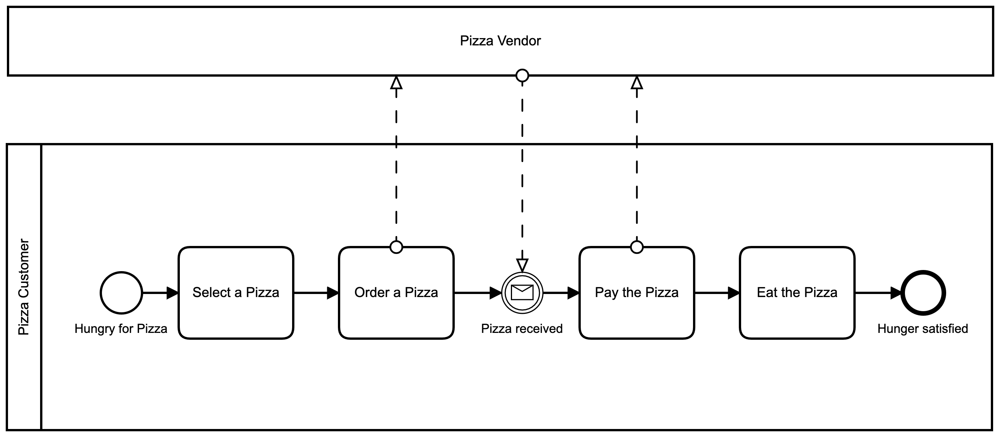

# Usability Test - Instructions

In the past, you've modeled a simple process diagram for ordering a pizza. You decided to use a collaboration diagram separated into the *Vendor* and the *Customer*.

The customer initiates the process who decided to order a pizza. After he selected one, he starts the order. 

The order starts with the vendor's part, who bakes the pizza and delivers it back to the customer. After receiving it, he pays for it and finally eats it.

Now your colleague Steve comes to you and tells you that the process should be simplified. The diagram should concentrate on the *Customer* part. He means that your department moves control over the *Vendor* part away, and it could be abstracted.

He asks you to modify the diagram to adapt to the changes.

